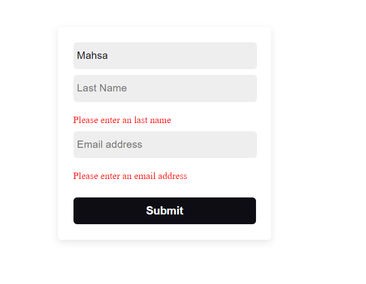

# 🔗 React-Form-Validation
---
## Preview

 
> [!NOTE]
> React Validation: Checks the inputs and returns an error if they are empty, and returns an alert if all the inputs are filled correctly.
> [!TIP]
 
> ## Libraries and packages used
> [SilverBoxjs](https://silverboxjs.ir/)
> [react-helmet](https://www.npmjs.com/package/react-helmet)
